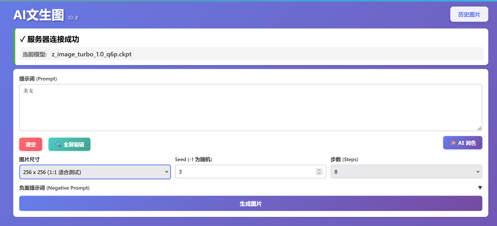
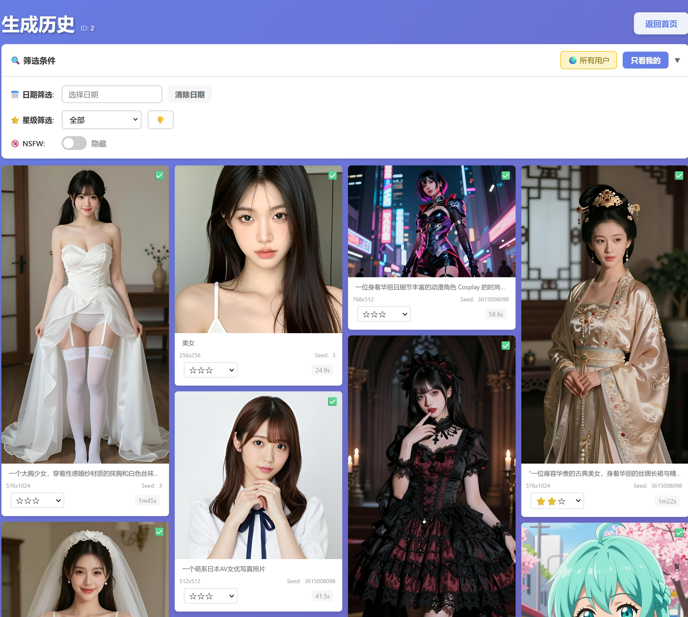

# DrawThings WebUI

一个基于 Python Flask 和静态 HTML 的 DrawThings Web 界面, 界面美观操作友好, 方便手机操作。  
用来实现远程(如果是外网环境需自行组网)操作mac上的DrawThings进行生图操作, 以及查看图片的功能.  
**注意: 需要自行安装DrawThings, 并且在DrawThings可以正常生图的情况下, 在高级中打开http server功能才能使用**



## 功能特性

- 服务器状态检查：自动检测 DrawThings 服务状态并显示当前提示词和模型
- 图片生成：支持自定义提示词、尺寸、seed、步数等参数
- 支持AI提示词润色(需要配置大模型API)
- 本地存储：自动保存用户输入，下次打开页面时自动填充
- 图片查看：支持放大、缩小、重置和保存生成的图片
- 耗时统计：记录每次生成的耗时并计算平均耗时
- **自动NSFW检测**：基于LLM的内容安全检测，自动识别并标记不当内容
- **星级评分系统**：为每张图片提供1-5星及Bad评级功能
- **智能筛选**：支持按日期、星级、NSFW状态等多维度筛选历史记录
- **批量清理**：一键删除所有标记为Bad的图片，同时清理数据库记录和原文件
- **日志记录**：自动记录图片生成和大模型调用的详细日志，便于问题追踪和分析

## 前置要求

1. Python 3.8 或更高版本
2. DrawThings 服务运行在 `127.0.0.1:8777`

## 安装步骤

1. 安装 Python 依赖：
   ```bash
   pip install -r requirements.txt
   ```

2. 确保 DrawThings 服务正在运行于 `127.0.0.1:8777`

## 运行服务

### Windows 用户（推荐）

双击运行 `start.bat` 脚本，它会自动检查依赖并启动服务。

### Linux/macOS 用户

#### Linux 系统
```bash
# 赋予执行权限
chmod +x start.sh

# 运行启动脚本
./start.sh
```

#### macOS 系统
```bash
# 赋予执行权限
chmod +x start_macos.sh

# 运行启动脚本（会自动打开浏览器）
./start_macos.sh
```

**macOS 特性：**
- 自动在3秒后打开浏览器访问 http://localhost:5000
- 如需取消自动打开浏览器，可在启动时按 Ctrl+C

### 手动启动

```bash
python src/app.py
```

服务将在 `http://localhost:5000` 启动。

## 使用说明

### 基本使用

1. 打开浏览器访问 `http://localhost:5000`
2. 页面会自动检查 DrawThings 服务器状态
3. 如果连接成功，填写生成参数：
   - **提示词**：描述你想要生成的图片内容
   - **图片尺寸**：从预设的尺寸中选择
   - **Seed**：随机种子（-1 表示随机）
   - **负面提示词**：不希望在图片中出现的内容（默认折叠）
   - **步数**：生成步数，越多质量越好但速度越慢
4. 点击"生成图片"按钮
5. 等待生成完成（可能需要几分钟）
6. 查看生成结果，可以放大、缩小、保存图片
7. 点击"返回重新生成"可以再次生成

### NSFW自动检测

当配置了LLM服务后，系统会自动检测生成内容的安全性：

1. **自动检测**：图片生成完成后，系统会使用LLM分析提示词内容
2. **实时警告**：如果检测到NSFW内容，会弹出警告窗口提醒用户
3. **自动标记**：NSFW图片会在数据库中标记，历史记录中可选择性显示
4. **隐私保护**：默认隐藏NSFW图片，需要手动开启显示开关

配置方法：在 `config.json` 中添加LLM相关配置：
```json
{
  "llm_api_url": "http://your-llm-server/v1/chat/completions",
  "llm_model": "your-model-name",
  "llm_api_key": "your-api-key"
}
```

### 历史记录管理

访问 `http://localhost:5000/history.html` 进入历史记录页面：

#### 评分功能
- **星级评分**：点击星星(★)为图片进行1-5星评分
- **Bad标记**：点击"👎 Bad"按钮标记不喜欢的图片
- **跨用户评分**：可以为任何用户的图片进行评分

#### 筛选功能
- **日期筛选**：选择特定日期查看历史记录
- **星级筛选**：支持多选，可同时选择多个星级（如同时查看5星和4星图片）
- **NSFW筛选**：可选择显示或隐藏NSFW内容
- **用户视图**：切换"只看我的"或"查看所有用户"

#### 批量清理
- **删除Bad图片**：在Bad筛选状态下，可一键删除所有标记为Bad的图片
- **安全机制**：必须先在Bad筛选状态下才能执行删除操作
- **双重清理**：同时删除数据库记录和原文件，释放存储空间

### 日志记录功能

系统会自动记录详细的运行日志，便于问题追踪和性能分析：

- **图片生成日志** (`logs/image_generation.log`): 记录每次图片生成的参数、耗时、结果等信息
- **大模型调用日志** (`logs/llm_calls.log`): 记录所有LLM API调用，包括NSFW检测和提示词润色

查看日志：
```bash
# Windows PowerShell
Get-Content logs\image_generation.log -Tail 50
Get-Content logs\llm_calls.log -Tail 50

# Linux/Mac
tail -f logs/image_generation.log
tail -f logs/llm_calls.log
```

详细说明请查看 [docs/LOGGING_FEATURE.md](docs/LOGGING_FEATURE.md)

## 项目结构

```
drawThingsWebUI/
├── app.py                  # Flask 主应用入口
├── database.py             # 数据库操作模块
├── history_routes.py       # 历史记录路由模块
├── requirements.txt        # Python 依赖
├── start.bat              # Windows 启动脚本
├── start.sh               # Linux 启动脚本
├── start_macos.sh         # macOS 启动脚本
├── README.md              # 项目说明文档
├── .gitignore             # Git 忽略配置
│
├── static/                # 静态资源
│   ├── index.html         # 主页
│   └── history.html       # 历史记录页面
│
├── generated_images/      # 生成的图片（自动创建，已忽略）
├── tests/                 # 测试文件
│   ├── test_*.py          # 各种功能测试
│   └── verify_refactoring.py  # 重构验证
│
├── docs/                  # 文档目录
│   ├── DIRECTORY_STRUCTURE.md  # 目录结构说明
│   ├── MODULES.md              # 模块化架构
│   ├── AUTO_NSFW_DETECTION.md  # NSFW检测功能说明
│   ├── RATING_FEATURE.md       # 评分功能说明
│   ├── MULTI_RATING_FILTER_FEATURE.md  # 多选筛选功能说明
│   ├── DELETE_BAD_IMAGES_FEATURE.md    # 删除Bad图片功能说明
│   ├── LOGGING_FEATURE.md      # 日志记录功能说明
│   └── *.md                    # 其他功能说明文档
│
├── scripts/               # 工具脚本
│   ├── migrate_add_rating.py   # 评分字段迁移脚本
│   ├── migrate_add_nsfw.py     # NSFW字段迁移脚本
│   └── cleanup.py              # 清理脚本
│
└── 数据文件（自动生成）
    ├── history.db              # SQLite 数据库
    ├── config.json             # DrawThings 配置
    ├── timing_stats.json       # 耗时统计
    ├── generation_history.json # 旧版 JSON（仅迁移用）
    └── logs/                   # 日志目录
        ├── image_generation.log  # 图片生成日志
        └── llm_calls.log         # 大模型调用日志
```

详细的目录结构说明请查看 [docs/DIRECTORY_STRUCTURE.md](docs/DIRECTORY_STRUCTURE.md)

## API 接口

### GET /api/status
检查 DrawThings 服务器状态

**响应示例：**
```json
{
  "success": true,
  "prompt": "当前提示词",
  "model": "当前模型",
  "raw_data": {...}
}
```

### POST /api/generate
生成图片

**注意：** 系统限制最多同时有5个生成任务，超过限制的请求将被拒绝（HTTP 429）。

**请求体：**
```json
{
  "prompt": "提示词",
  "negative_prompt": "负面提示词",
  "width": 768,
  "height": 768,
  "seed": -1,
  "steps": 20
}
```

**响应示例（成功）：**
```json
{
  "success": true,
  "image_url": "/generated_images/generated_20260409_120000.png",
  "image_filename": "generated_20260409_120000.png",
  "elapsed_time": 120.5,
  "average_time": 115.3,
  "seed": 1234567890
}
```

**响应示例（并发限制）：**
```json
{
  "success": false,
  "error": "当前已有 5 个任务正在生成中，请稍后再试（最多允许5个并发任务）"
}
```

### POST /api/rating
为图片评分

**请求体：**
```json
{
  "image_id": "图片ID",
  "rating": 5  // 评分值：1-5星，-1为Bad，0为取消评分
}
```

**响应示例：**
```json
{
  "success": true,
  "message": "评分已更新"
}
```

### GET /api/history
获取历史记录

**查询参数：**
- `date`: 日期筛选 (YYYY-MM-DD)
- `rating`: 星级筛选，支持多选，用逗号分隔 (如: 5,4,-1)
- `show_nsfw`: 是否显示NSFW内容 (true/false)
- `all_users`: 是否显示所有用户的记录 (true/false)
- `page`: 页码
- `per_page`: 每页数量

**响应示例：**
```json
{
  "success": true,
  "history": [...],
  "total": 100,
  "page": 1,
  "per_page": 20
}
```

### DELETE /api/history/bad
删除所有标记为Bad的图片

**查询参数：**
- `rating`: 必须为 -1 (安全校验)
- `all_users`: 是否删除所有用户的Bad图片 (true/false)

**响应示例：**
```json
{
  "success": true,
  "message": "成功删除 6 张 Bad 图片",
  "deleted_count": 6,
  "files_deleted": 6,
  "files_failed": 0
}
```

### GET /api/nsfw-status/{image_id}
检查图片的NSFW状态

**响应示例：**
```json
{
  "success": true,
  "is_nsfw": false,
  "checked": true
}
```

## 注意事项

### 基本要求
- 首次运行前请确保 DrawThings 服务已启动
- 图片生成可能需要较长时间（约 5 分钟）
- 生成的图片会保存在 `generated_images` 目录
- 用户的输入会自动保存到浏览器本地存储

### NSFW检测功能
- 需要配置LLM服务才能启用自动NSFW检测
- 检测结果依赖于LLM模型的准确性，建议定期校准
- NSFW图片默认隐藏，保护隐私和合规性
- 可通过历史记录页面的开关手动显示/隐藏NSFW内容

### 评分与筛选
- 评分数据存储在SQLite数据库中，建议定期备份
- 星级筛选支持多选，可灵活组合不同评级
- Bad图片删除操作不可恢复，请谨慎操作
- 跨用户评分功能允许多用户协作评审

### 性能优化
- 大量历史记录时建议使用分页加载
- 定期清理Bad图片和不需要的记录可提升查询性能
- 数据库索引已优化，支持快速筛选和查询

## 测试与故障排除

### 运行测试
项目包含多个测试脚本，用于验证各项功能：

```bash
# 测试NSFW检测功能
python tests/test_auto_nsfw.py

# 测试评分功能
python tests/test_rating.py

# 测试多选筛选功能
python tests/test_multi_rating.py

# 测试删除Bad图片功能
python tests/test_delete_bad.py

# 测试跨用户评分
python tests/test_cross_user_rating.py
```

### 常见问题

#### NSFW检测不工作？
1. 检查 `config.json` 中是否正确配置了LLM相关参数
2. 确认LLM服务是否正常运行并可访问
3. 查看后端控制台是否有错误日志
4. 验证数据库中是否存在 `is_nsfw` 字段

#### 评分功能异常？
1. 确认数据库中存在 `rating` 字段（运行迁移脚本）
2. 检查浏览器控制台是否有JavaScript错误
3. 验证API请求是否成功发送

#### 历史记录加载缓慢？
1. 使用日期或星级筛选减少数据量
2. 定期清理不需要的历史记录
3. 检查数据库文件大小，必要时进行优化

### 数据迁移
如果从旧版本升级，需要运行相应的迁移脚本：

```bash
# 添加评分字段
python scripts/migrate_add_rating.py

# 添加NSFW字段
python scripts/migrate_add_nsfw.py
```

## 贡献与扩展

欢迎贡献代码或提出建议！主要扩展方向：
- 更多AI模型集成
- 更丰富的图片编辑功能
- 团队协作功能增强
- 性能优化和缓存机制
